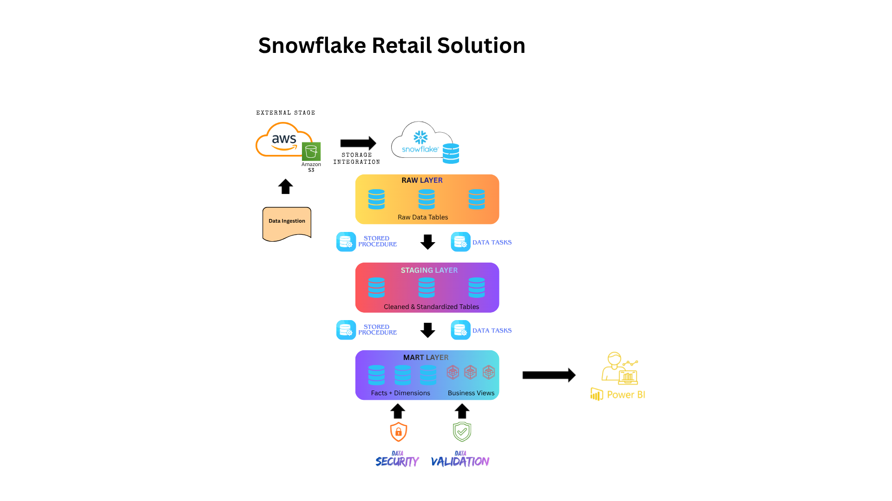
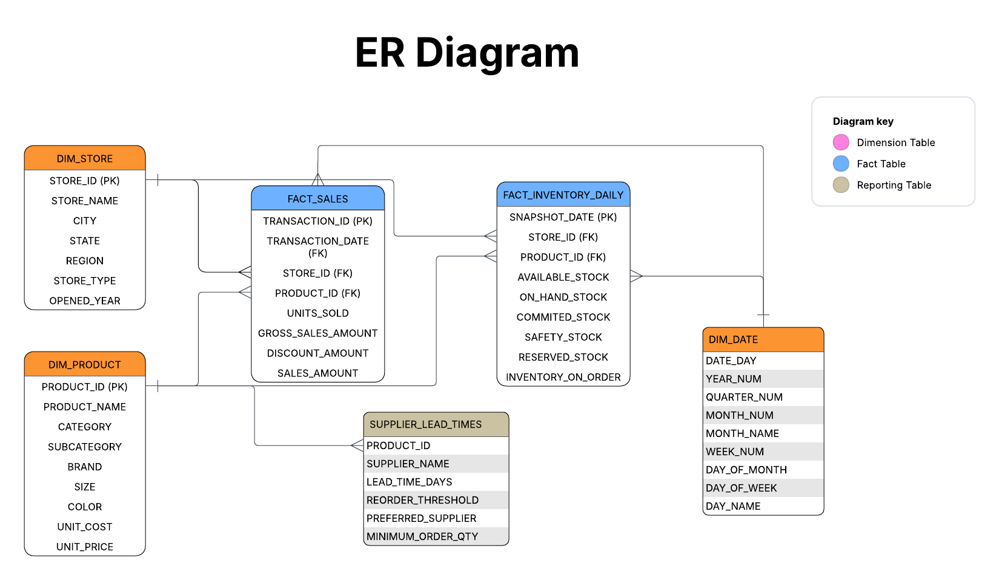

<h1 align="center"> 🚀 Snowflake Retail Inventory Intelligence Platform </h1>
<p align="center">
  <b>End-to-End Data Engineering & Analytics Project on Snowflake</b><br>
  Built for real-world retail inventory optimization & sales intelligence
</p>

<p align="center">
  
  
  
  
  
</p>

---

## 📌 Overview

This project simulates a real-world **retail analytics platform** built on Snowflake to solve critical business problems around:

- 📈 Sales performance tracking  
- 📦 Inventory optimization  
- ⚠️ Stockout risk detection  
- 🔁 Replenishment planning  

It demonstrates **end-to-end data engineering**, from ingestion to business insights.

---

## 🎯 Problem Statement

Retail companies often operate with disconnected systems, leading to:

- ❌ Lack of real-time visibility into inventory  
- ❌ Inefficient replenishment decisions  
- ❌ Overstocking or stockouts  

👉 This project builds a **centralized, scalable Snowflake solution** to solve these challenges.

---

## 🏗️ Architecture

<p align="center">
  
</p>


---

## 🧱 Data Model

<p align="center">
  
</p>

### ⭐ Star Schema Design

**Fact Tables**
- FACT_SALES
- FACT_INVENTORY_DAILY

**Dimension Tables**
- DIM_PRODUCT
- DIM_STORE
- DIM_DATE

✔ Optimized for fast analytical queries  
✔ Designed for BI tools and reporting  

---

## ⚙️ Key Features

### 🔄 Data Ingestion
- CSV + JSON data loading
- Snowflake stages + `COPY INTO`
- Semi-structured data handling (VARIANT)

---

### 🧹 Data Transformation
- Layered architecture: **RAW → STAGING → MART**
- Data cleaning & validation:
  - Null handling
  - Deduplication
  - Standardization

---

### 🧠 Dimensional Modeling
- Star schema design
- Fact & dimension separation
- Business-ready data modeling

---

### 🧮 Advanced SQL
- CTEs  
- Window Functions  
- Aggregations  
- Business rule implementation  

---

### ⚡ Automation
- Stored Procedures  
- Scheduled Tasks for pipeline automation  

---

### 📊 Business Intelligence Layer

Created analytical views:

- `VW_SALES_PERFORMANCE`
- `VW_INVENTORY_HEALTH`
- `VW_REORDER_RECOMMENDATIONS`

💡 These enable:
- Sales trend analysis  
- Inventory monitoring  
- Reorder decision-making  

---

### 🔐 Security
- Role-based access control (RBAC)
- Secure data access across roles

---

## 📊 Sample Insights Generated

- 📈 Total Sales Trends  
- 📦 Inventory Levels  
- ⏳ Days of Inventory Cover  
- ⚠️ Stockout Risk Flags  
- 🔁 Reorder Recommendations  

---

## 🛠️ Tech Stack

| Layer           | Technology        |
|-----------------|------------------|
| Data Warehouse  | Snowflake        |
| Storage         | AWS S3           |
| Language        | SQL              |
| Visualization   | Power BI         |
| Orchestration   | Snowflake Tasks  |

---

## 📂 Project Structure

```bash
snowflake-retail-intelligence/
│
├── data/
├── sql/
├── docs/
│   ├── architecture.png
│   ├── er_diagram.png
│   └── screenshots/
│
└── README.md

```

## 📸 Screenshots

> Add these for maximum impact:

- Snowflake schema  
- Query execution  
- Task execution  
- Dashboard visuals  
- ER diagram  

---

## ▶️ How to Run

1. Create Snowflake database and schemas  
2. Upload data to AWS S3  
3. Create stage and file formats  

4. Run SQL scripts in order:
   - Setup  
   - Raw tables  
   - Load data  
   - Transformations  
   - Mart tables  
   - Views  

5. *(Optional)* Connect Power BI / Streamlit  

---

## 📈 Business Impact

This solution enables:

- ✅ Real-time inventory visibility  
- ✅ Data-driven replenishment decisions  
- ✅ Reduced stockouts and overstock scenarios  
- ✅ Improved operational efficiency  

---

## 🧠 Key Learnings

- End-to-end data pipeline design in Snowflake  
- Dimensional modeling for analytics  
- Performance optimization techniques  
- Data governance and access control  

---

## 💡 Future Enhancements

- Add forecasting model (ML-based demand prediction)  
- Implement Streams for incremental processing   
- Build a real-time dashboard  

---

## 👤 Author

**Avinash Vishala Nagaraja**  
Business Intelligence & Data Analytics Professional  
Snowflake Certified | Data Engineering | BI Engineering  

---

## ⭐ Why This Project Matters

This project demonstrates:

- Real-world data engineering skills  
- Strong SQL and modeling capabilities  
- Understanding of business-driven analytics  
- Snowflake best practices  
